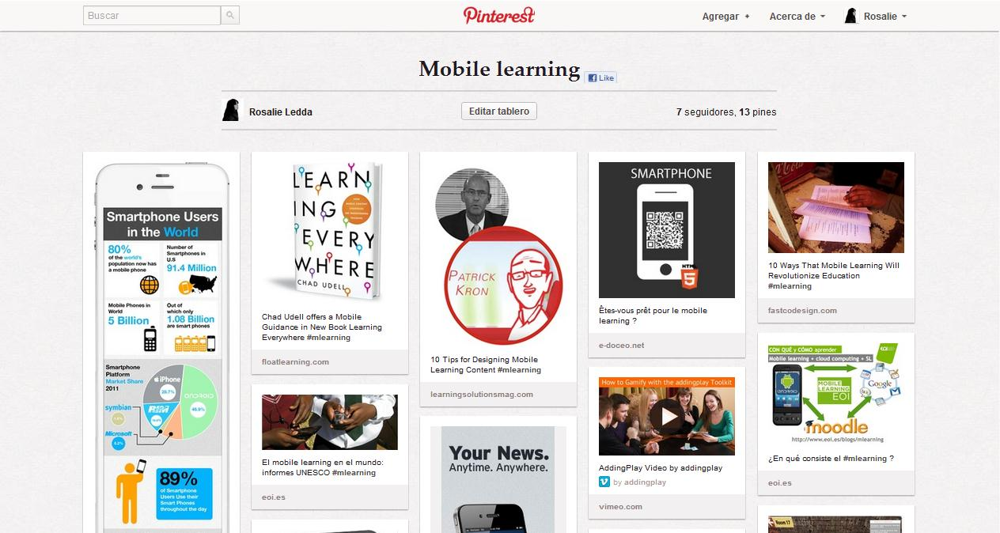

# 1.Elige una web de tu preferencia y explica qué partes conforman el UX y qué partes el UI

*Pinterest
*Youtube
*Laboratoria

## Pinterest

UX:
*-Es una red sociable de recuerdos basados en emociones, entrevista a un usuario, sketcher, wireframes, estudio antropológico y psicológico de los potenciales usuarios.

UI:
*-Menús, desplegables, botones, enlaces / links, ventanas, sombreado, actualizaciones, campos de contraseña, campos de búsqueda, entradas de texto, estados de selección, estados presionados, información sobre herramientas, fotografias adjuntadas, animaciones de desplazamiento, desplazamiento, iconografía, colores, listas, etc.; personalizan cada cuenta según las necesidades y deseos de los usuarios identificados, para que la navegación sea más placentera.

